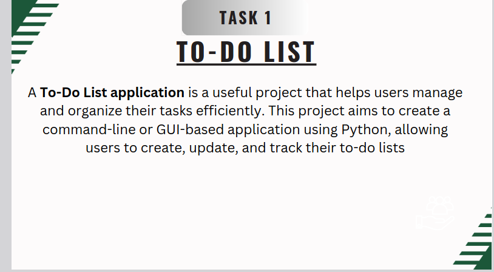
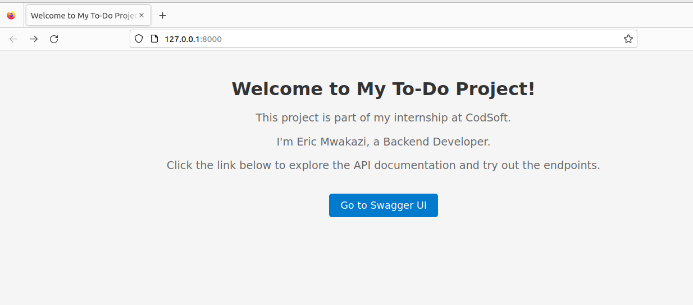
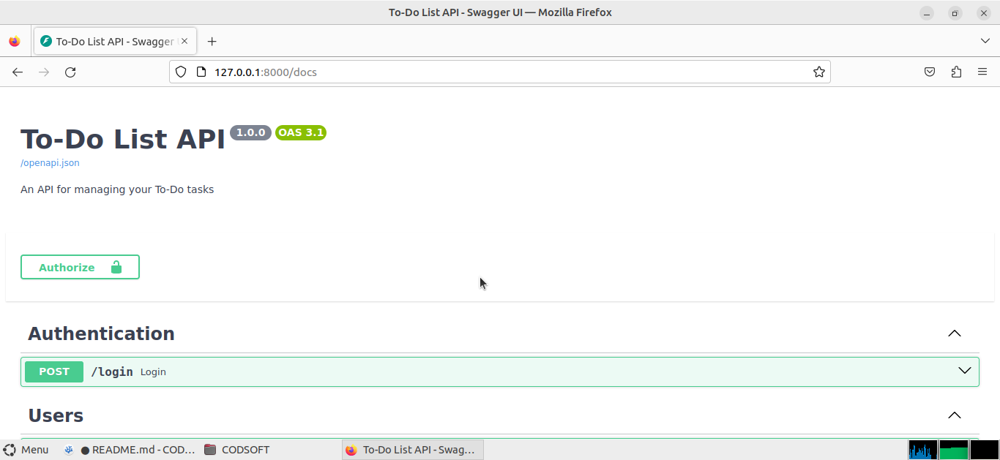
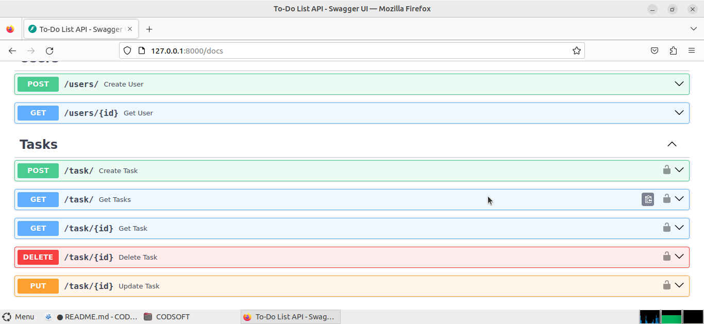

# Task 1


## Requirements
    Texteditor
    python3 and pip
## Installation
While inside the TODOAPP folder run below commands:
1. To create virtual env
```
python3 -m venv venv
```
2. Activate the environment linux systems
```
source venv/bin/activate
```
3. Install dependecies
```
pip install -r requirements.txt
```
4. Create .env file with sample:
```
DATABASEURL="sqlite:///./test.db"
SECRET_KEY="your_secret_key_here"
ALGORITHM="HS256"
TOKEN_EXPIRATION=30
'''
5. Run the project:
```
python3 main.py
```
OR
```
uvicorn main:app --reload
```

## PROJECT





# Running test with pytest
```
pytest --html=report.html
```
Above generates a report of test run and save results in report.html

